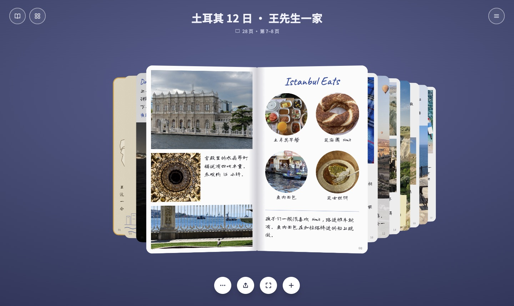
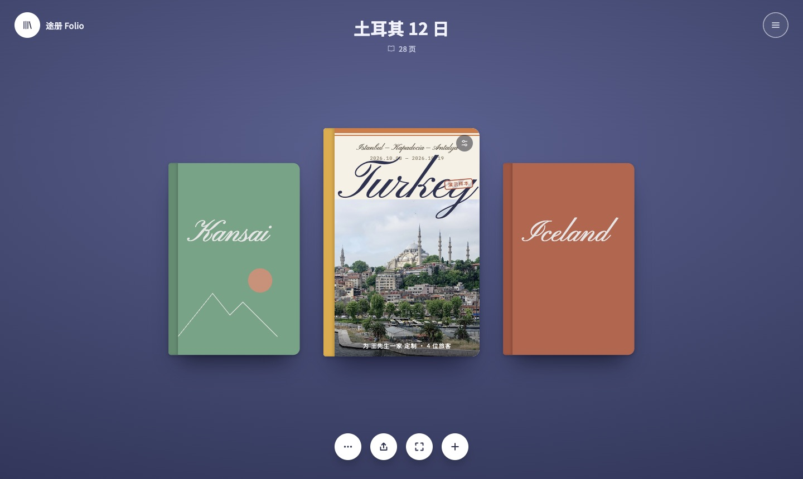
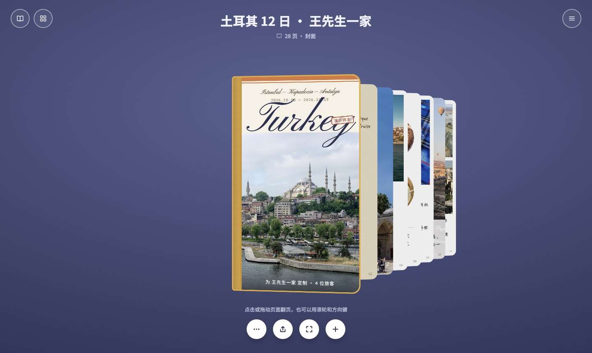
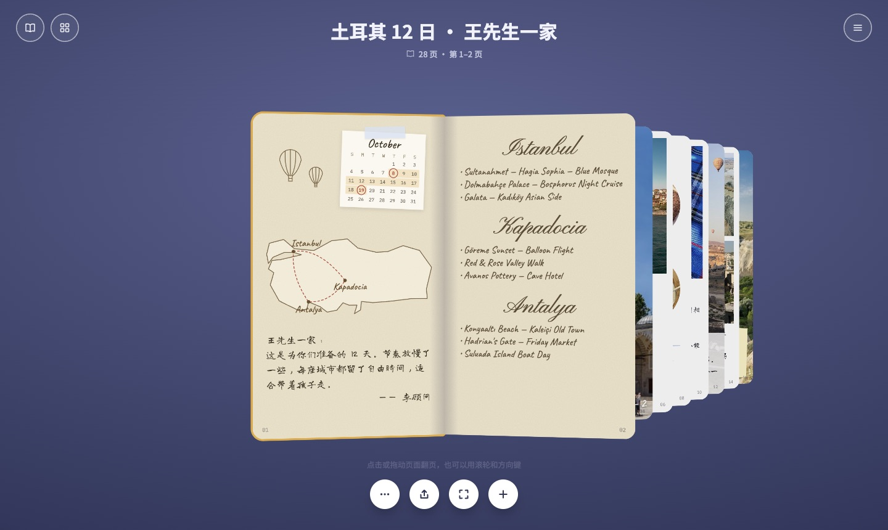
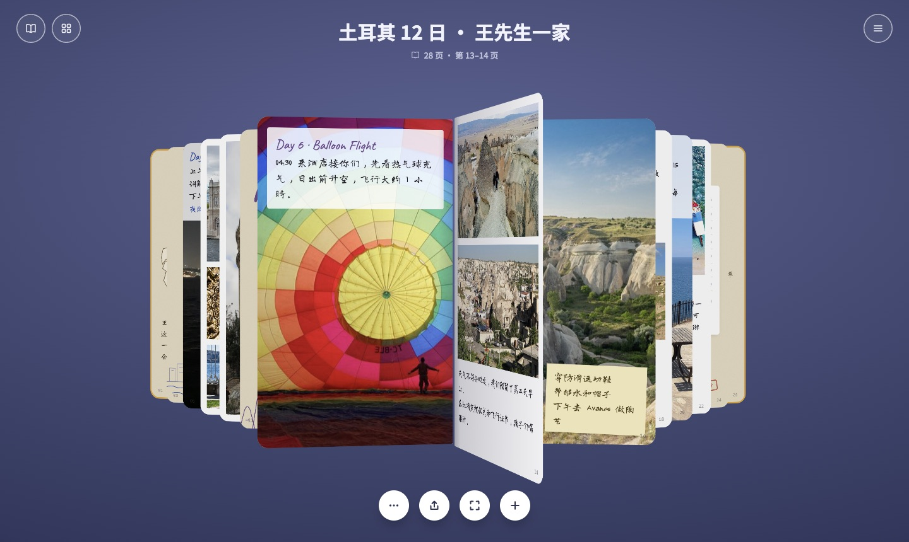
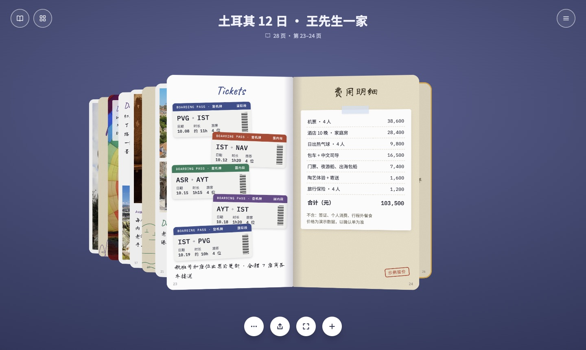
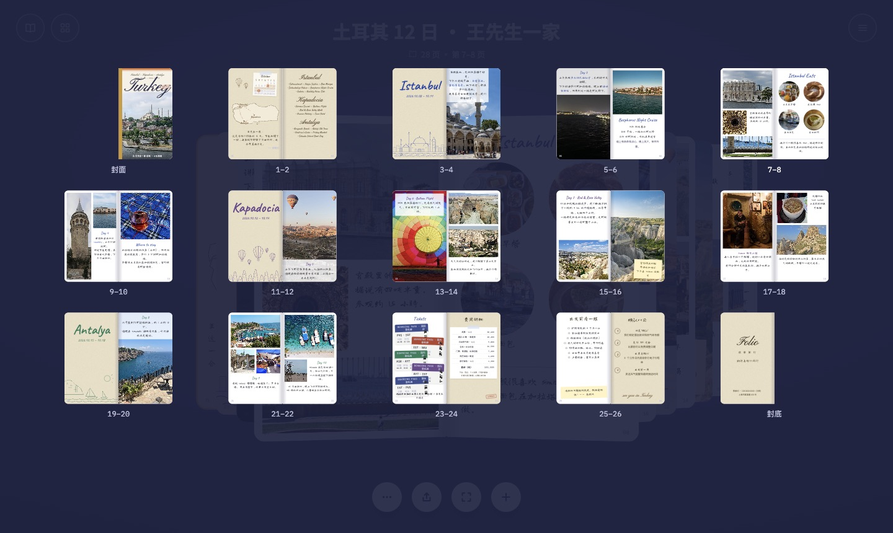
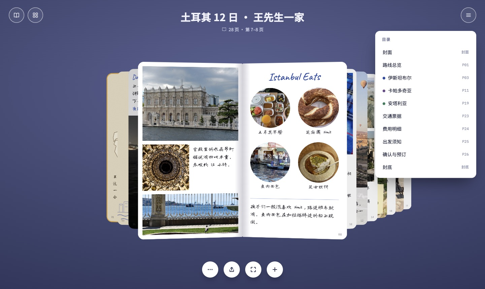
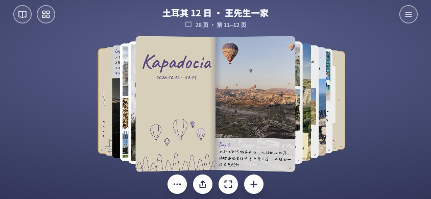

# Travel-book

把旅行行程做成一本可以翻的小书。

客户打开后先看到书架，点开书就像翻真书一样一页页看：中间是摊开的两页，左右两侧是扇形叠放的其他页，点击、拖动、滚轮、方向键都能翻页。整本书只有一个 HTML 文件，照片和字体都打包在里面，发给别人用浏览器打开就能看，不联网也能正常显示。

仓库里的示例是一份虚构的客户方案 **土耳其 12 日**（伊斯坦布尔 → 卡帕多奇亚 → 安塔利亚），共 28 页。

> 演示样本：客户、日期、价格和顾问信息都是虚构的，页面上标有“演示样本”和“示例报价”。



## 快速开始

下载 [`dist/土耳其12日-翻书旅行方案.html`](dist/)，用 Chrome、Safari 或 Edge 打开。

- **电脑上效果最好**，翻书的立体效果最明显。
- **手机建议横屏**，竖屏时页面底部会提示横过来看。
- **通过微信发送时**，微信自带的预览打开 HTML 经常出问题，需要点右上角选“用其他应用打开”或“在浏览器打开”。

## 截图说明

### 1. 开场说明


第一次打开时弹出一张说明卡，告诉看的人这是什么、怎么翻页、目录在哪。点“开始翻阅”直接打开书。

### 2. 书架



书架上并排放着几本方案，中间那本放大显示，顶部显示书名和页数。点两侧的书会把它换到中间，点中间那本打开。示例里只有“土耳其 12 日”有内容，“Kansai”“Iceland”只是摆着看效果的封面。

底部四个圆按钮从左到右依次是：

| 按钮 | 作用 |
|---|---|
| ··· | 关于这本方案，以及全部照片的出处和许可 |
| 上传图标 | 发给别人的说明 |
| 四角图标 | 在书架上打开书；在书里切换全屏 |
| + | 新建方案（演示版暂未开放） |

### 3. 封面



打开后先看到封面，书居中摆放，右侧是后面的页。封面有左侧黄色书脊、路线、日期、大号花体目的地名和“为某某定制”的字样。

### 4. 路线总览与城市清单



第 1–2 页是牛皮纸页。左页有一张 10 月日历贴纸，出发日和返程日用红圈标出；下面是土耳其线稿地图和三站路线虚线，最下方是顾问写给客户的一段话。右页用花体写三座城市名，每座城市下列出主要景点。

### 5. 行程页与美食页


内页采用手帐拼贴风：照片网格加白边、圆形美食照、手写字体说明。每一页单独成立，不跨页排版，翻页时画面不会被书脊折断。

### 6. 翻页过程



翻页时只有被翻的那一页绕书脊转动，左右两侧的叠页各自往前或往后挪一格：

- 页面抬起时，右侧叠页往里挪，下一页刚好在被翻的页后面就位。
- 页面落下时，左侧叠页往外退一格，被落下的页盖住。
- 拖动翻页时，所有页跟着手指的进度同步移动。拖过四分之一松手就翻过去，否则弹回。

### 7. 交通票据与报价



交通页把五段航程做成错落摆放的登机牌卡片，标出日期、时长和人数。报价页是一张贴在牛皮纸上的费用明细，右下角盖“示例报价”章。

### 8. 全部页面



点左上角的四宫格按钮，会以缩略图列出所有跨页。点任意一张直接跳过去，当前所在的跨页会高亮。

### 9. 目录



点右上角的菜单按钮打开目录，三座城市前有各自的颜色标记，右侧是页码。点任意一项跳到对应页。

### 10. 手机横屏



屏幕较矮时，顶部标题和底部按钮会自动缩小，书也按屏幕高度缩放，铺满整个画面。

## 操作方式

| 操作 | 效果 |
|---|---|
| 点击右页 / 左页 | 向后 / 向前翻一页 |
| 按住页面左右拖动 | 跟手翻页，松手后自动翻过去或弹回 |
| 鼠标滚轮 | 翻页 |
| ← → 方向键、空格 | 翻页 |
| Esc | 关闭目录和缩略图 |
| 左上角书本按钮 | 回到书架 |

## 书里的 28 页

| 页码 | 内容 |
|---|---|
| 封面 | 目的地、日期、客户名 |
| 1–2 | 日历、路线地图、写给客户的话；三城景点清单 |
| 3–10 | 伊斯坦布尔：标题页、老城、海峡夜游、宫殿、美食、加拉塔与亚洲区、住宿 |
| 11–18 | 卡帕多奇亚：标题页、日落、热气球、洞穴小镇、红谷徒步、陶艺、当地菜 |
| 19–22 | 安塔利亚：标题页、海边、老城与集市、出海 |
| 23 | 交通票据 |
| 24 | 费用明细 |
| 25 | 出发前清单 |
| 26 | 确认预订的四个步骤 |
| 封底 | 旅行社名称和联系方式 |

## 项目结构

| 路径 | 内容 |
|---|---|
| `index.html` | 源文件：页面内容、版式和翻书效果都在这里 |
| `images/` | 原始照片和 `credits.json`（每张照片的出处与许可） |
| `scripts/fetch_fonts.sh` | 下载用到的开源字体到 `fonts/` |
| `scripts/build.py` | 压缩照片、裁剪字体，打包成 `dist/` 里的单文件 |
| `scripts/fetch_imgs.py` | 当初从 Wikimedia Commons 查找照片用的脚本 |
| `docs/screenshots/` | README 里的截图 |
| `dist/` | 打包好的成品 |

## 实现原理

整本书不依赖任何第三方库，只用原生 HTML、CSS 和 JavaScript。

- **一张纸两面**：每一张纸（sheet）有正反两面，正面是右页，反面是左页，用 CSS 3D 的 `rotateY` 绕左边缘（书脊）转动，背面用 `backface-visibility: hidden` 隐藏。
- **叠页位置**：函数 `rest(i, st)` 计算书翻到第 `st` 个跨页时，第 `i` 张纸应该在哪。当前页平放在中间，其余的纸按距离依次往外错开、往后退，并略微倾斜，形成两侧的扇形叠页。
- **动画**：函数 `render(x)` 接受一个带小数的位置，例如 5.5 表示第 5 页翻到一半。被翻的那张纸按进度转动，两侧叠页分先后插值：右侧在前 70% 的时间里往前挪，左侧在后 70% 的时间里往后退，所以翻页时不会出现空缺或横扫。点击、滚轮、键盘和拖动都调用同一个 `render`，因此效果一致。
- **缩放**：函数 `fit()` 按窗口大小计算缩放比例，同时调整透视距离，保证不同屏幕上的立体感一致。

## 修改内容

页面内容写在 `index.html` 的 `PAGES` 数组里，每一项是一页，按顺序排列：

```js
{ toc:'伊斯坦布尔', sw:acc.ist, cls:'kraft chap', acc:acc.ist, html:`...` }
```

| 字段 | 作用 |
|---|---|
| `html` | 这一页的内容 |
| `cls` | 纸张样式：`white` 白纸、`kraft` 牛皮纸，`chap` 为城市标题页版式 |
| `acc` | 这一页的强调色 |
| `toc` | 填了就会出现在目录里 |
| `sw` | 目录里的颜色小圆点 |

常用的写法：

- `P('bluemosque', 'left:12px;top:12px;width:130px;height:130px')` 在指定位置放一张照片，名字对应 `IMG` 里的键。
- `class="hw"` 手写字体段落，`class="abs"` 绝对定位。
- 城市标题页的线稿插画由 `skyline()`、`cappa()`、`seaside()` 生成，路线地图由 `turkeyMap()` 生成。

换照片：把新照片放进 `images/`，在 `IMG` 里加一行，并在 `images/credits.json` 里写上出处和许可。

书架上的其他几本书在 `BOOKS` 数组里。

## 重新打包

直接用浏览器打开 `index.html` 就能预览，只是字体要联网从 Google Fonts 加载。要生成可以离线发送的单文件：

```bash
./scripts/fetch_fonts.sh                      # 只需第一次，下载约 47MB 字体
python3 -m venv .venv && .venv/bin/pip install fonttools brotli
PATH=.venv/bin:$PATH .venv/bin/python scripts/build.py
```

打包脚本会：

1. 把用到的照片压缩到最长边 900 像素（使用 macOS 自带的 `sips`；其他系统直接复制原图，成品会大一些）。
2. 只保留页面上实际用到的字符，把字体从约 47MB 裁到约 700KB。
3. 把照片、字体、照片出处全部内嵌，输出到 `dist/土耳其12日-翻书旅行方案.html`，约 6MB。

## 已知限制

- 翻页时纸张是整张转动的，没有纸张弯曲的效果。
- 手机竖屏只做了提示横屏，还没有一次显示一页的竖屏版式。
- “发给客户”“新建方案”两个按钮在演示版里只弹出说明。
- 内容目前写在代码里，换目的地需要改 `index.html`。之后计划做成“填表格生成”的模板。

## 照片出处

照片均来自 Wikimedia Commons，按各自的知识共享许可使用。使用 CC BY / CC BY-SA 许可的照片需要署名，BY-SA 的衍生作品需以相同许可发布。页面里点底部“···”按钮也能看到这份清单。

| 文件 | 原图 | 作者 | 许可 |
|---|---|---|---|
| `antalya_cliff.jpg` | [Antalya Lara Cliff view.jpg](https://commons.wikimedia.org/wiki/File:Antalya_Lara_Cliff_view.jpg) | My-view2U | CC BY-SA 4.0 |
| `avanos.jpg` | [In pottery shop in Avanos, Cappadocia, Turkey, May, 2015.jpg](https://commons.wikimedia.org/wiki/File:In_pottery_shop_in_Avanos,_Cappadocia,_Turkey,_May,_2015.jpg) | Alexey Komarov | CC BY-SA 4.0 |
| `balik.jpg` | [Vendeurs de balik ekmek (1).jpg](https://commons.wikimedia.org/wiki/File:Vendeurs_de_balik_ekmek_(1).jpg) | Jpbazard Jean-Pierre Bazard | CC BY-SA 3.0 |
| `bluemosque.jpg` | [Courtyard of the Blue Mosque, Istanbul. (54505628417).jpg](https://commons.wikimedia.org/wiki/File:Courtyard_of_the_Blue_Mosque,_Istanbul._(54505628417).jpg) | Mustang Joe | CC0 |
| `boat.jpg` | [From Bosphorus cruise sightseeing boat - panoramio.jpg](https://commons.wikimedia.org/wiki/File:From_Bosphorus_cruise_sightseeing_boat_-_panoramio.jpg) | Laima Gūtmane (simka… | CC BY-SA 3.0 |
| `bosphorus.jpg` | [Bosphorus panorama with bridge from Kiz Kulesi Istanbul 2024.jpg](https://commons.wikimedia.org/wiki/File:Bosphorus_panorama_with_bridge_from_Kiz_Kulesi_Istanbul_2024.jpg) | Furkan Akkurt | CC BY-SA 4.0 |
| `breakfast.jpg` | [Istanbul (29).jpg](https://commons.wikimedia.org/wiki/File:Istanbul_(29).jpg) | Mostafameraji | CC BY 3.0 |
| `cap_balloons.jpg` | [Balloons over Goreme.JPG](https://commons.wikimedia.org/wiki/File:Balloons_over_Goreme.JPG) | José Luiz | CC BY-SA 3.0 |
| `cap_pano.jpg` | [Cappadocia Balloon Inflating Wikimedia Commons.JPG](https://commons.wikimedia.org/wiki/File:Cappadocia_Balloon_Inflating_Wikimedia_Commons.JPG) | Benh LIEU SONG (Flickr) | CC BY-SA 3.0 |
| `cavehotel.jpg` | [View over Goreme from Sunset Cave Hotel Terrace - Goreme - Cappadocia - Turkey (5760943819).jpg](https://commons.wikimedia.org/wiki/File:View_over_Goreme_from_Sunset_Cave_Hotel_Terrace_-_Goreme_-_Cappadocia_-_Turkey_(5760943819).jpg) | Adam Jones from Kelowna, BC, Canada | CC BY-SA 2.0 |
| `cover.jpg` | [Süleymaniye Mosque, Istanbul, 20260606 0805 1307.jpg](https://commons.wikimedia.org/wiki/File:S%C3%BCleymaniye_Mosque,_Istanbul,_20260606_0805_1307.jpg) | Jakub Hałun | CC BY 4.0 |
| `dolma_ext.jpg` | [Pond and Fence along the Bosporus Strait, Dolmabahçe Palace, Istanbul.jpg](https://commons.wikimedia.org/wiki/File:Pond_and_Fence_along_the_Bosporus_Strait,_Dolmabah%C3%A7e_Palace,_Istanbul.jpg) | Julian Lupyan | CC0 |
| `dolma_gate.jpg` | [Dolmabahçe Palace and Sultans gate april 19 2014.jpg](https://commons.wikimedia.org/wiki/File:Dolmabah%C3%A7e_Palace_and_Sultans_gate_april_19_2014.jpg) | This Photo was taken by Wolfgang Moroder.  

Feel free to use my photos, but ple | CC BY-SA 3.0 |
| `dolma_in.jpg` | [Chandelier inside Dolmabahçe Palace, Istanbul.jpg](https://commons.wikimedia.org/wiki/File:Chandelier_inside_Dolmabah%C3%A7e_Palace,_Istanbul.jpg) | Julian Lupyan | CC0 |
| `ferry.jpg` | [Kadikoey, Istanbul (P1100156).jpg](https://commons.wikimedia.org/wiki/File:Kadikoey,_Istanbul_(P1100156).jpg) | Matti Blume | CC BY-SA 4.0 |
| `galata2.jpg` | [Galata Tower January 2015.JPG](https://commons.wikimedia.org/wiki/File:Galata_Tower_January_2015.JPG) | Martin Falbisoner | CC BY-SA 4.0 |
| `goreme.jpg` | [Panorama goreme.jpg](https://commons.wikimedia.org/wiki/File:Panorama_goreme.jpg) | Maliharehman | CC BY-SA 4.0 |
| `hadrian.jpg` | [Hadrian's Gate, Antalya 01.jpg](https://commons.wikimedia.org/wiki/File:Hadrian%27s_Gate,_Antalya_01.jpg) | Bernard Gagnon | CC BY-SA 3.0 |
| `kaleici.jpg` | [Antalya kaleiçi 2.jpg](https://commons.wikimedia.org/wiki/File:Antalya_kalei%C3%A7i_2.jpg) | REHBER0770 | CC BY-SA 4.0 |
| `konyaalti.jpg` | [Konyaaltı Beach, Antalya, Turkey 2022 Waiter.jpg](https://commons.wikimedia.org/wiki/File:Konyaalt%C4%B1_Beach,_Antalya,_Turkey_2022_Waiter.jpg) | Sharon Hahn Darlin | CC BY 2.0 |
| `kunefe.jpg` | [Knafeh From Yaffa Knafeh.jpg](https://commons.wikimedia.org/wiki/File:Knafeh_From_Yaffa_Knafeh.jpg) | Theipu | CC0 |
| `market.jpg` | [Bursa market Turkey 2013 2.jpg](https://commons.wikimedia.org/wiki/File:Bursa_market_Turkey_2013_2.jpg) | Karelj | CC BY-SA 3.0 |
| `redvalley.jpg` | [Cappadocia Goreme hike red valley badlands.jpg](https://commons.wikimedia.org/wiki/File:Cappadocia_Goreme_hike_red_valley_badlands.jpg) | Aquinoxmedia | CC BY-SA 4.0 |
| `rosevalley.jpg` | [Rose Valley, Cappadocia - Kızılçukur Vadisi, Kapadokya 08.jpg](https://commons.wikimedia.org/wiki/File:Rose_Valley,_Cappadocia_-_K%C4%B1z%C4%B1l%C3%A7ukur_Vadisi,_Kapadokya_08.jpg) | Zeynel Cebeci | CC BY-SA 4.0 |
| `simit.jpg` | [Simit-2x.JPG](https://commons.wikimedia.org/wiki/File:Simit-2x.JPG) | — | CC BY-SA 3.0 |
| `suluada.jpg` | [Adrasan Suluada.jpg](https://commons.wikimedia.org/wiki/File:Adrasan_Suluada.jpg) | Erturkercin | CC BY-SA 4.0 |
| `tea.jpg` | [Glass of tea 05119.jpg](https://commons.wikimedia.org/wiki/File:Glass_of_tea_05119.jpg) | Nevit Dilmen | CC BY-SA 3.0 |
| `testi.jpg` | [TestiKebabGoreme.jpg](https://commons.wikimedia.org/wiki/File:TestiKebabGoreme.jpg) | Niels Elgaard Larsen | CC BY-SA 3.0 |
| `uchisar.jpg` | [Castle Uçhisar in Cappadocia.jpg](https://commons.wikimedia.org/wiki/File:Castle_U%C3%A7hisar_in_Cappadocia.jpg) | This Photo was taken by Wolfgang Moroder.  

Feel free to use my photos, but ple | CC BY-SA 3.0 |

## 字体

Long Cang、Noto Sans SC、Noto Serif SC、Caveat、Pinyon Script、IBM Plex Mono，均为 [SIL Open Font License](https://openfontlicense.org) 开源字体，来自 [google/fonts](https://github.com/google/fonts)。

## 字体

Long Cang、Noto Sans SC、Noto Serif SC、Caveat、Pinyon Script、IBM Plex Mono，均为 [SIL Open Font License](https://openfontlicense.org) 开源字体，来自 [google/fonts](https://github.com/google/fonts)。打包后的文件内嵌了这些字体的子集，同样遵循 OFL。

## 代码

页面代码、版式和线稿插画为本项目原创。
